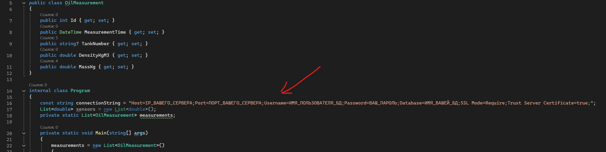
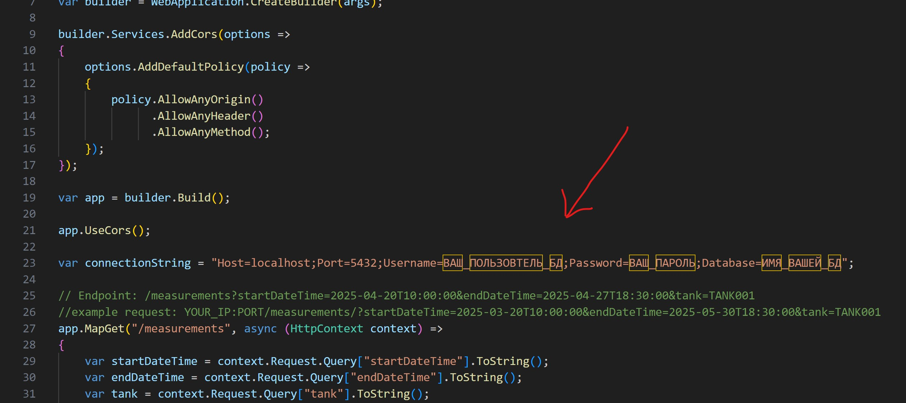
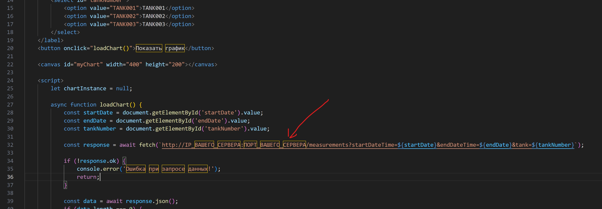
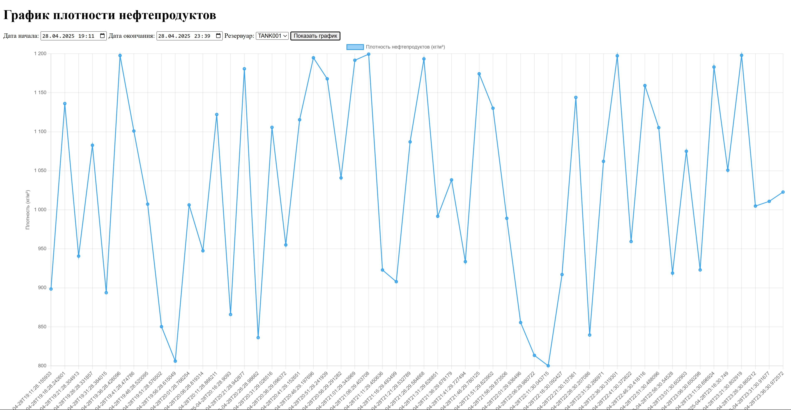

# TankMonitoringProject
# Система мониторинга свойств нефтепродуктов в резервуарах

## 📌 Описание проекта

Проект предназначен для эмуляции замеров плотности нефтепродуктов в резервуарах, расчёта массы и визуализации этих данных через веб-интерфейс.
---

### 📦 Состав проекта:
- PostgreSQL база данных — хранение данных измерений.
- .NET Core эмулятор — генерирует плотность, рассчитывает массу и записывает данные в БД.
- Web-интерфейс (HTML/JS) — отображает графики массы с фильтрами по дате и резервуару.
- REST API (JSON-сервис) — отдаёт данные для веб-интерфейса.
---

## 🛠️ Используемые технологии

- .NET Core
- PostgreSQL
- HTML + JavaScript
- pgAdmin
- Ubuntu Server
---

## 📐 Архитектура

[Эмулятор (.NET Core)] ---> [PostgreSQL DB] <--- [REST API] <--- [Web-интерфейс (index.html)]
---

## 🗃️ Структура БД

```sql
CREATE TABLE IF NOT EXISTS public.oil_measurements
(
    id integer NOT NULL DEFAULT nextval('oil_measurements_id_seq'::regclass),
    measurement_time timestamp without time zone NOT NULL,
    tank_number text COLLATE pg_catalog."default" NOT NULL,
    density_kg_m3 numeric(10,2) NOT NULL,
    mass_kg numeric(12,2) NOT NULL,
    CONSTRAINT oil_measurements_pkey PRIMARY KEY (id)
);
```
---


## 🚀 Запуск проекта

1. Установка PostgreSQL
    ```bash
    sudo apt install postgresql
    sudo -u postgres psql
    CREATE DATABASE tank_monitoring;
    ```
    
2. Создание таблицы
   
    В базе данных выполните SQL-скрипт из файла /SQL/CREATE запрос.txt
   

4. Сборка и запуск эмулятора
   
   Настройте строку подключения в /EmulationDensitySensors/Program.cs
    

   ```bash
    cd /API/WebOilServerCS
    dotnet restore
    dotnet run
   ```
    
5. Запуск REST API

    Настройте строку подключения в /API/WebOilServerCS/Program.cs
    
    ```bash
    cd /API/WebOilServerCS
    dotnet restore
    dotnet run
    ```

6. 🌐 Веб-интерфейс

    Настройте URL запрос в WebInterface/index.html
    
    Откройте файл WebInterface/index.html в браузере.

---


